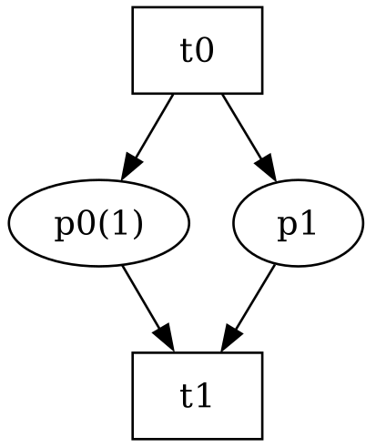
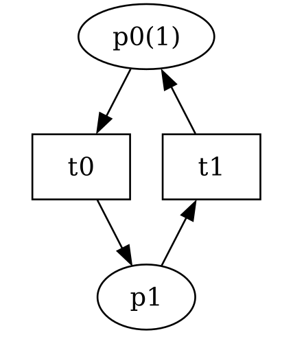

# PetriSpot

## Introduction

PetriSpot is a standalone command-line utility for analyzing Petri nets in PNML format (ISO/IEC 15909-2). It computes a generative basis of P and/or T flows and semi-flows using efficient algorithms based on sparse data structures. This tool is a modern C++ reimplementation of the [algorithm](https://hal.science/hal-04142675) from [ITS-Tools](https://github.com/lip6/ITSTools).

PetriSpot represents the state-of-the-art in invariant computation, as indicated by [extensive comparisons](https://github.com/yanntm/InvariantPerformance) on the models of the [Model Checking Contest](https://mcc.lip6.fr).

## Installation

### Pre-built Binaries

Pre-built binaries are available for Linux and Windows:
- [Linux](https://github.com/yanntm/PetriSpot/tree/Inv-Linux)
- [Windows](https://github.com/yanntm/PetriSpot/tree/Inv-Windows)

Three versions are available based on integer size: `petri32`, `petri64`, and `petri128`. Use a larger version if computation overflows.

### Building from Source

To build from source, follow these steps:

1. Clone the repository:
    ```sh
    git clone -b invariant https://github.com/yanntm/PetriSpot.git
    cd PetriSpot
    ```

2. The build uses GitHub Actions for CI/CD. Necessary package dependencies are tracked in the workflows within the `.github` folder. The `build.sh` script compiles and deploys all dependencies, including Spot for LTL and libGMP and libExpat for the parser.

    To build the project, run:
    ```sh
    ./build.sh
    ```

## Usage

To use PetriSpot, run the following command:

```sh
./petri -i [model.pnml] [flags]
```

### Parameters

#### `[model.pnml]`

- Path of the model file in .pnml format (ISO/IEC 15909-2 standard)

#### `[flags]`

- `-q`: Quiet mode (avoids printing the invariants, used for performance evaluation)
- `--Pflows`: Compute generative basis of generalized flows on places
- `--Psemiflows`: Compute generative basis of semi-flows on places
- `--Tflows`: Compute generative basis of generalized flows on transitions
- `--Tsemiflows`: Compute generative basis of semi-flows on transitions
- `--findDeadlock`: Proof of concept for finding deadlocks (not heavily tested)

## Examples

### Example 1: Petri Net with One Transition Semi-Flow and One Generalized Place Flow



#### Command

```sh
../src/petri64 --Pflows --Tflows -i examples/net1.pnml
```

#### Trace

```
[2024-05-30 14:38:41] [INFO   ] Running PetriSpot with arguments : [--Pflows, --Tflows, -i, net1.pnml]
[2024-05-30 14:38:41] [INFO   ] Parsing pnml file : net1.pnml
[2024-05-30 14:38:41] [INFO   ] Parsed PT model containing 2 places and 2 transitions and 4 arcs in 0 ms.
// Phase 1: matrix 2 rows 2 cols
[2024-05-30 14:38:42] [INFO   ] Computed 1 invariants in 0 ms
Computed 1 P flows in 0 ms.
inv : p0 - p1 = 1
Total of 1 invariants.
Normalized transition count is 1 out of 2 initially.
// Phase 1: matrix 1 rows 2 cols
[2024-05-30 14:38:42] [INFO   ] Computed 1 invariants in 0 ms
Computed 1 T flows in 0 ms.
inv : t0 + t1 = 0
Total of 1 invariants.
Total runtime 0 ms.
```

### Example 2: Petri Net with One Transition Semi-Flow and One Place Semi-Flow




#### Command

```sh
../src/petri64 --Pflows --Tflows -i examples/net2.pnml
```

#### Trace

```
[2024-05-30 14:39:02] [INFO   ] Running PetriSpot with arguments : [--Pflows, --Tflows, -i, net2.pnml]
[2024-05-30 14:39:02] [INFO   ] Parsing pnml file : net2.pnml
[2024-05-30 14:39:02] [INFO   ] Parsed PT model containing 2 places and 2 transitions and 4 arcs in 0 ms.
// Phase 1: matrix 2 rows 2 cols
[2024-05-30 14:39:02] [INFO   ] Computed 1 invariants in 0 ms
Computed 1 P flows in 0 ms.
inv : p0 + p1 = 1
Total of 1 invariants.
[2024-05-30 14:39:02] [INFO   ] Invariant cache hit.
Computed 1 T flows in 0 ms.
inv : t0 + t1 = 0
Total of 1 invariants.
Total runtime 0 ms.
```

The examples can be found in the `examples/` folder.

## License

PetriSpot is FOSS licensed under the GPL v3.

## Authors

- Yann Thierry-Mieg (LIP6, Sorbonne Université)
- Etienne Renault (LRDE, Epita)
- Soufiane El Mahdi (Master 1 student, Sorbonne Université)

## Contributing

For communication, please use the issue tracker or contact Yann Thierry-Mieg directly at yann.thierry-mieg@lip6.fr.

## Acknowledgements

This project is supported by LIP6, Sorbonne Université, and CNRS.

