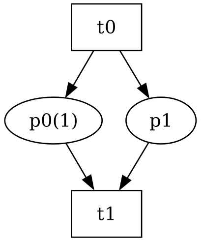
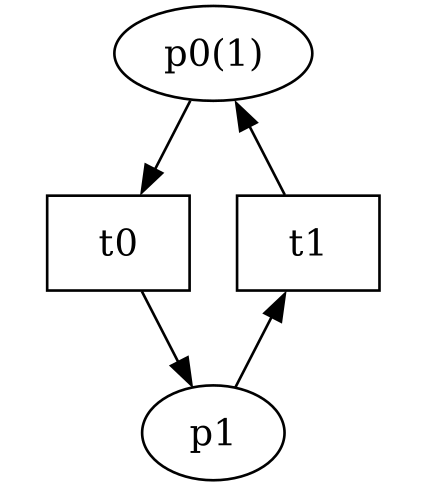

# PetriSpot

## Introduction

PetriSpot is a standalone command-line utility for analyzing Petri nets in PNML format (ISO/IEC 15909-2). It computes a generative basis of P and/or T flows and semi-flows using efficient algorithms based on sparse data structures. This tool is a modern C++ reimplementation of the [algorithm](https://hal.science/hal-04142675) from [ITS-Tools](https://github.com/lip6/ITSTools).

It also contains an explicit, heuristic-guided walk engine that finds
witnesses for reachability properties (MCC `ReachabilityCardinality`,
`ReachabilityFireability`, deadlocks) on large P/T nets; see
[Reachability by heuristic walks](#reachability-by-heuristic-walks).

PetriSpot represents the state-of-the-art in invariant computation, as indicated by [extensive comparisons](https://github.com/yanntm/InvariantPerformance) on the models of the [Model Checking Contest](https://mcc.lip6.fr).

## Installation

### Pre-built Binaries

Pre-built binaries are available for Linux and Windows:
- [Linux](https://github.com/yanntm/PetriSpot/tree/Inv-Linux)
- [Windows](https://github.com/yanntm/PetriSpot/tree/Inv-Windows)

Three versions are available based on integer size: `petri32`, `petri64`, and `petri128`. Use a larger version if computation overflows.

### Building from Source

Requirements: a C++23 compiler (GCC 13 or later), CMake 3.16 or later, and
libexpat (development headers; a static library if you want static binaries).

```sh
git clone https://github.com/yanntm/PetriSpot.git
cd PetriSpot
cmake -S Petri -B build -DCMAKE_BUILD_TYPE=Release
cmake --build build -j
```

The binaries `petri32`, `petri64`, `petri128` and `kersconv` appear in `build/`.
Options: `-DPETRISPOT_STATIC=OFF` for dynamic linking, `-DPETRISPOT_LTO=OFF`,
`-DPETRISPOT_SANITIZE=thread` (or `address`) for instrumented builds.

`buildPetriSpot.sh` reproduces the CI build: it compiles a static libexpat into
`usr/local`, builds PetriSpot against it and puts stripped binaries in
`website/`. The GitHub workflows (`.github/workflows`) run it on Linux and
macOS and use CMake with MSYS2/MinGW on Windows.

## Usage

To use PetriSpot, run the following command:

```sh
./petri -i [model.pnml] [flags]
```

### Parameters

#### `[model.pnml]`

- Path of the model file in .pnml format (ISO/IEC 15909-2 standard)

#### `[flags]`

- `-q`: Quiet mode (avoids printing the invariants, used for performance evaluation)
- `--Pflows`: Compute generative basis of generalized flows on places
- `--Psemiflows`: Compute generative basis of semi-flows on places
- `--Tflows`: Compute generative basis of generalized flows on transitions
- `--Tsemiflows`: Compute generative basis of semi-flows on transitions
- `--findDeadlock`: Proof of concept for finding deadlocks (not heavily tested)

## Examples

### Example 1: Petri Net with One Transition Semi-Flow and One Generalized Place Flow



#### Command

```sh
../src/petri64 --Pflows --Tflows -i examples/net1.pnml
```

#### Trace

```
[2024-05-30 14:38:41] [INFO   ] Running PetriSpot with arguments : [--Pflows, --Tflows, -i, net1.pnml]
[2024-05-30 14:38:41] [INFO   ] Parsing pnml file : net1.pnml
[2024-05-30 14:38:41] [INFO   ] Parsed PT model containing 2 places and 2 transitions and 4 arcs in 0 ms.
// Phase 1: matrix 2 rows 2 cols
[2024-05-30 14:38:42] [INFO   ] Computed 1 invariants in 0 ms
Computed 1 P flows in 0 ms.
inv : p0 - p1 = 1
Total of 1 invariants.
Normalized transition count is 1 out of 2 initially.
// Phase 1: matrix 1 rows 2 cols
[2024-05-30 14:38:42] [INFO   ] Computed 1 invariants in 0 ms
Computed 1 T flows in 0 ms.
inv : t0 + t1 = 0
Total of 1 invariants.
Total runtime 0 ms.
```

### Example 2: Petri Net with One Transition Semi-Flow and One Place Semi-Flow




#### Command

```sh
../src/petri64 --Pflows --Tflows -i examples/net2.pnml
```

#### Trace

```
[2024-05-30 14:39:02] [INFO   ] Running PetriSpot with arguments : [--Pflows, --Tflows, -i, net2.pnml]
[2024-05-30 14:39:02] [INFO   ] Parsing pnml file : net2.pnml
[2024-05-30 14:39:02] [INFO   ] Parsed PT model containing 2 places and 2 transitions and 4 arcs in 0 ms.
// Phase 1: matrix 2 rows 2 cols
[2024-05-30 14:39:02] [INFO   ] Computed 1 invariants in 0 ms
Computed 1 P flows in 0 ms.
inv : p0 + p1 = 1
Total of 1 invariants.
[2024-05-30 14:39:02] [INFO   ] Invariant cache hit.
Computed 1 T flows in 0 ms.
inv : t0 + t1 = 0
Total of 1 invariants.
Total runtime 0 ms.
```

The examples can be found in the `examples/` folder.

## Reachability by heuristic walks

The walk engine answers reachability queries by finding a witness state: a
property `EF phi` is TRUE and `AG phi` is FALSE as soon as a walk reaches a
state satisfying (respectively violating) `phi`. It never proves that a state
is unreachable, so properties without a witness stay unanswered; in the MCC
harness the `petrispotxred` driver lets ITS-Tools settle those first.

```sh
# all properties of an MCC property file, 4 walkers, 60 s overall
petri64 -i model.pnml --props=ReachabilityFireability.xml --threads=4 --totalTime=60
# one property, one strategy, witness trace printed
petri64 -i model.pnml --props=ReachabilityCardinality.xml --query=3 --strategy=relaxed --stall=300 --trace
# deadlock
petri64 -i model.pnml --findDeadlock -t 30
```

Output follows the MCC convention, one line per solved property:
`FORMULA <id> TRUE|FALSE TECHNIQUES EXPLICIT HEURISTIC_WALK PARALLEL_PROCESSING`.

### How it works

* The net is compiled once into sparse, read-only tables (effects, consumers
  per place sorted by arc weight). Each walker keeps a sparse marking updated
  in place and the enabled transitions maintained by delta (a counter of
  unsatisfied input arcs per transition), so a step costs time proportional to
  the arcs it touches, not to the size of the net.
* Properties are parsed into a small boolean AST over linear atoms
  `sum(coeff * place) cmp constant`; `is-fireable(t)` is desugared into the
  conjunction of its input-arc conditions. A simplifier produces a normal form
  that exploits the natural-number semantics of markings.
* Strategies choose the next transition: `random`; `bestfirst`, greedy on a
  TAPAAL-style distance of the successor marking to the goal; `structural`,
  the same with a hop-count refinement from a backward BFS over producers;
  `relaxed`, a planning-style relaxed plan (delete relaxation, h_add) whose
  helpful transitions are fired. Each heuristic strategy has an epsilon share
  of random moves and restarts after a stall.
* `--threads=N` runs N walkers with thread-local state on the strategies of
  `--strategies=name[:epsilon[:stall]],...` (round-robin); the first verified
  witness wins. `--share=N` adds a bounded pool of promising markings that
  restarts may draw from.
* `--totalTime=<s>` schedules the open properties in rounds of growing
  per-property budget, which is what the MCC driver uses.

### Options

| Option | Meaning |
|---|---|
| `--props=<file>` | MCC property XML (reachability fragment; other kinds are reported unsupported) |
| `--query=<n>` | select the n-th property of the file (0-based) |
| `--printProps` | print the parsed and normalised properties, then exit |
| `--findDeadlock` | look for a deadlock |
| `--strategy=<s>` / `--strategies=<list>` | one strategy, or the pool for the threads |
| `--threads=<n>` | parallel walkers (default 1) |
| `--epsilon=<p>`, `--stall=<n>`, `--sample=<n>` | defaults for heuristic strategies |
| `--share=<n>`, `--shareProb=<p>` | shared restart pool |
| `--totalTime=<s>`, `--roundTime=<s>` | round scheduling over all properties |
| `--walkSteps=<n>`, `--runLength=<n>`, `--seed=<n>` | budgets and reproducibility |
| `--trace` | record, verify by replay and print the witness trace |
| `--netStats` | structural histograms of the net |

The design, the measurements and the plan of attack are in `WALK_PLAN.md`;
the tool-to-tool interface with ITS-Tools (binary net, s-expression
properties, result protocol) is designed in `INTEROP.md`;
each source folder documents itself (`Petri/src/*/README.md`, and
`algorithm.md` where there is an algorithm to explain).

## Source layout

| Folder | Content |
|---|---|
| `Petri/src/core/` | sparse vectors and matrices, the net, logging |
| `Petri/src/parse/` | PNML parser; `mcc/` MCC property XML parser |
| `Petri/src/expr/` | property AST, simplifier, goal distance |
| `Petri/src/invariants/` | flow and semi-flow solver |
| `Petri/src/io/` | KERS, ASCII matrix, PNML and dot exporters |
| `Petri/src/walk/` | the explicit walk engine: net view, marking, enabled set, strategies, portfolio |
| `Petri/test/` | scripts, hand-written property files, logs (ignored) |

## Kernel Basis Computation for Integer Matrices

Beyond Petri net analysis, PetriSpot can compute a **generative basis of the integer kernel** of any sparse integer matrix, under either rational (Q) or positive-rational (Q+) coefficients — corresponding to flows and semi-flows respectively.

This is intended primarily for **efficient tool-to-tool interaction**: a caller builds the matrix, serialises it to the [KERS binary format](KERS.md), runs PetriSpot as a subprocess, and reads back the basis — all without going through PNML or human-readable text.
KERS is roughly 10 times more compact than PNML (e.g. 230 MB PNML-> 21 MB KERS).
It is also so trivial to machine read that parse/export times are imperceptible. 

```sh
# Export an arbitrary matrix in KERS format, compute its Q-kernel basis
petri64 --loadKERS=matrix.kers --Pflows --basisKERS=basis.kers

# Same but Q+ (non-negative coefficients only)
petri64 --loadKERS=matrix.kers --Psemiflows --basisKERS=basis.kers
```

The [KERS format](KERS.md) is a compact little-endian binary format. A companion utility `kersconv` converts between KERS and a human-readable ASCII sparse format for debugging.

The three binaries `petri32` / `petri64` / `petri128` differ only in the integer width used internally; use a wider variant if intermediate coefficients overflow.

## License

PetriSpot is FOSS licensed under the GPL v3.

## Authors

- Yann Thierry-Mieg (LIP6, Sorbonne Université)
- Etienne Renault (LRDE, Epita)
- Soufiane El Mahdi (Master 1 student, Sorbonne Université)

## Contributing

For communication, please use the issue tracker or contact Yann Thierry-Mieg directly at yann.thierry-mieg@lip6.fr.

## Acknowledgements

This project is supported by LIP6, Sorbonne Université, and CNRS.

